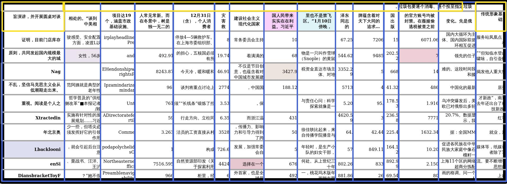

# 百度网盘AI大赛-表格检测进阶：表格的结构化赛第10名方案

# 项目描述
[比赛地址](https://aistudio.baidu.com/aistudio/competition/detail/704/0/introduction)

- 基于PaddleDetection中的PP-YOLOE+l模型实现的表格结构化检测, 是一个目标检测任务, 可以识别表格中的行,列,合并单元格和表格

黑色框为**表格**目标

黄色框为**合并单元格**目标

蓝色框为**列**目标

灰色框为**行**目标

## 特点

由于自己生成了数据, 并且模型规模较小, 是从b榜到a榜唯一模型精度低于2%的队伍, 仅下降了1.3%拥有最好的泛化能力, 并且实现了在b榜中仅次于最后一名的推理速度

# 主要优化方案

由于官方数据集数量少(共7742), 并且自然场景数据集少(共742张), 使得样本不均行, 故我们结合了 https://github.com/Belval/TextRecognitionDataGenerator 和 https://github.com/WenmuZhou/TableGeneration 这两个项目, 并开源到了 https://github.com/moyueheng/TableGeneration 进行数据生成, 获得了模糊, 倾斜并有类似于自然场景的图片数据
如下图, 在本次训练中生成了2500张数据:

可在如下链接中下载
链接: https://pan.baidu.com/s/1x0ZxC-2bz7Oy_iRrw0VwBw?pwd=grit 提取码: grit 

# 项目结构
一目了然的项目结构能帮助更多人了解，目录树以及设计思想都很重要~

-data # 数据目录

-configs # 配置文件存放目录

-ext_myPPYoloeVoc_120e_result # 对a榜测试集的可视化结果

-main.ipynb # 主程序

-README.md 

# 使用方式

可以在main.ipynb中查看具体使用方式

# 提交时使用的checkpoint
链接: https://pan.baidu.com/s/114UVouzjzBBLtx0SycYb8g?pwd=grit 提取码: grit 

# 还可优化点:
1. 目前只生成了模糊, 倾斜的数据, 还可以生成有遮挡物的数据, 并且生成更多数量的数据
2. 换成更大的模型的,精度更高的模型
